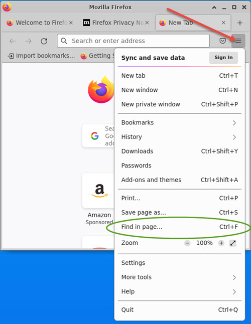

# Tips for CKA-CKAD-CKS

Quick tips on exam-day preparation. Points about proctor check in and workspace preparation apply to all Linux Foundation online proctored exams.

Note that there is no option to take Linux Foundation exams at test centres.

**IMPORTANT** Beginning June 25 2022, the exam is now delivered via the PSI Secure Browser which is software you must install from a download link provided during the exam registration process. You no longer conduct the exam from your own Chrome browser, therefore you can't use pre-prepared bookmarks.

The Certified Kubernetes exams are all online-proctored. This means that you do them from your own workstation, not at a test centre, while connected to a proctor who is watching you through your camera and your terminal via screen share.

They are also performance based. This means that you have to solve somewhere between 17 and 25 questions using a Linux desktop provided in the exam portal.

* [Am I Ready?](#am-i-ready)
* [Workspace Preparation](#workspace-preparation)
* [Your Workstation](#your-workstation)
* [Launching the Exam](#launching-the-exam)
* [The Exam Portal](#the-exam-portal)
    * [Issues with the Exam Portal](#issues-with-the-exam-portal)
* [Pro Tips](#pro-tips) - Boost your productivity!
* [Exam Environment Configuration](#exam-environment-configuration)
    * [VIM (VI)](#vim-vi)
    * [Creating and using your own aliases and exports](#creating-and-using-your-own-aliases-and-exports)
    * [TMUX](#tmux)
* [Specific Questions About The Exam](#specific-questions-about-the-exam)
# Am I Ready?

Always the burning question!

I think take the following into consideration.

* You can complete the mock exams and lightning labs (KodeKloud/Udemy Mumshad Mannambeth courses) faster than the instructor (where a solution video is posted) with no errors. Generally this means 20-30 min depending on the test.
* Now buy your exam. Wait for a decent coupon code to come up - these are always publicised on the KodeKloud slack channels. You have a year to actually schedule it.
* Do one of your two attempts at killer.sh. Reset it as many times as necessary in the 36 hours you have. You're aiming to complete it within 10 points of maximum score ideally in little more than 90 minutes. Killer is arguably *harder* than the real exam!
    * If you achieve that on the first session, you're probably ready.
    * If you don't - read and understand the killer solutions, go back, revise the lectures, redo the labs, give it a few weeks.
* Schedule the exam for say two weeks in the future
* Between scheduling and taking, do the second killer session. You will get the same questions so it should be easy this time.
* Take the exam - good luck!

# Workspace Preparation

The area about your person and around where you will be sitting must be completely free of clutter, distractions and anything that the proctor may consider that you could be using to gain some sort of advantage. Proctors are *very* fussy about this so the more stuff you can get out of the way before you start the process the better, or you will find it very stressful when you keep getting asked to move things and re-sweep the area with the camera.

* Make sure there are no objects (other than furniture) within 2 metres of where you are sitting, other than the computer equipment required for the exam. You are also allowed water in a clear glass. No pens, paper, books, electronics or any other clutter or anything with text on (that could be seen by proctor as a cheat sheet), including on the walls.</br>Anything you can move, move it - no matter how unobtrusive you think it may be!
* Remove all wristwear. Ideally wear a short-sleeve (T) shirt so it can be seen you are not concealing anything.
* If there are removable drawers in your desk, best to remove them.
* If you have a printer nearby, remove the paper (I was asked to do this).
* Anything that's not easily moved like a big bookshelf, throw a sheet over it.
* Keep your phone nearby. You will be explicitly asked to show it to the camera and then move it to a location out of reach behind you during the check in process.

Please also read carefully Linux Foundation's [Exam Rules and Policies](https://docs.linuxfoundation.org/tc-docs/certification/lf-handbook2/exam-rules-and-policies)

# Your Workstation

* Windows is the platform that people have reported the fewest issues with. Mac should also be fine. Some people have had issues with Linux workstations. Note that only Ubuntu Bionic (18.04) and Focal (20.04) are supported. Jammy (22.04) _claims_ to be supported, but don't trust this yet. There have been issues reported launching the PSI software installer. No other distro or version.
* Do not use a workstation belonging to your employer, unless you have the ability to use an admin account on it.
* Since this is a custom browser, you do not have the ability to use pre-prepared bookmarks.
* Make sure you can move your camera. A plug-in USB camera on a long lead is recommended to facilitate the check in process (see Launching the exam below).
* Multiple monitors are not allowed as of June 2022. The PSI Secure Browser checks will look for all enabled monitors and refuse to proceed if it detects more than one. If you have more than one monitor, remove the others. If you have a laptop with an external monitor and the external monitor is better than the laptop display, then you must ensure the laptop display is disabled (your display settings should only register the external monitor). If you're unable to disable the laptop monitor, then close the lid (which should disable it) and connect USB keyboard/mouse/camera.
* You are _strongly_ recommended to use a high-res monitor, e.g. 4K or close. If you're only using a standard 1920x1080 HD display, you will get very little screen real-estate for the Linux desktop environment, due to the side panel for the questions, and the control menu bar at the top.<br>You are not recommended to use a small laptop display (like 13 or 14 inch) that you have to use scaling on to be able to read the text. Anything other than 100% scale and you'll be seriously disadvantaged!</br>See also [Can I use an external monitor](https://github.com/kodekloudhub/community-faq#can-i-use-an-external-monitor) on the KodeKloud community FAQ.
* If you live in an area with a high chance of power cuts, consider tethering your laptop to your phone. Ensure both are fully charged and will last the (anything up to 3 hours) required including proctor setup. If you have a desktop computer consider buying a small UPS. <br>**IMPORTANT** This method has not yet been proven, so raise a ticket with Linux Foundation to check that use of phone wi-fi is acceptable.
* If you have made changes to your normal environment to fit the exam conditions (e.g. any of the above), test it thoroughly in advance of exam day!
* On a lighter note, there *should* be fewer issues connecting with the proctor and getting screen sharing working.

Additionally

* Log into your computer using an account with admin/root privilege - you'll need it during preparation. **This pretty much rules out the use of any corporate device!**

# Launching the Exam.

**IMPORTANT** No one must enter the room while the exam is in progress, or the proctor may terminate the exam and you will forfeit the attempt!

Note that you should practice getting a clear shot of your ID using your webcam *well before* exam day. Even consider building something to hold the ID card steady using your kids Lego or something :smile:.

This image shows a 10 year old Logitech QuickCam Pro 9000 pointed at a train ticket which is the same size as my photo ID. By mounting like this, the camera is stable and will autofocus, plus it leaves your hands free to click the button on the UI to take the shot. Be prepared to adjust the rig slightly at exam time to frame the shot correctly. The white envelope behind it provides a neutral backdrop. I have used this rig twice in Linux Foundation exams with no issues from proctor.


And the picture it took


You are allowed to launch the session 30 minutes before your scheduled time. You will need all those 30 minutes, so connect promptly, as before you even talk to the proctor, you need to complete the self check-in process. This goes as follows:

* Use the link provided to download the PSI software. *Do not* use any version you have from a previous Linux Foundation exam - uninstall that first and prior to launching the exam.
* Install and run it
* It will then do a system check - here is where you will need your admin privileges!
    * **IMPORTANT** Just because your machine passed the system check you ran from the Linux Foundation portal page _does not_ guarantee you will get through this section unscathed! That initial check is only for basic compatibility as the browser app does not have full permissions to check everything that will be checked by the installed PSI software.
    * It will check only [one monitor is active](https://github.com/kodekloudhub/community-faq#can-i-use-multiple-monitors).
    * It will check that your microphone and camera are working.
    * It will check that required outgoing ports are not blocked (likely if you're connected to a [corporate network](https://github.com/kodekloudhub/community-faq#can-i-use-a-corporate-device)).
    * It may check that you are not using a VPN (not sure about this, but best you don't use one).
    * It will then check for programs that should not be running, some of which may be operating system services. You have to stop all these things and keep re-running the check until it is happy. It will offer to terminate them for you, however it is recommended you stop them yourself using recommended methods to shut down programs and services. PSI software will force-terminate which may crash your machine. Programs include, but are not limited to the following, and you should aim to close down as many of these as possible _before_ you launch the exam session:
        * Any foreground process other than the PSI software. This includes programs that may be running in the system tray (Windows)
        * Hypervisor services (Hyper-V, VMware, Parallels, KVM etc.)
        * Docker
        * Cloud Drive applications (GoogleDrive, OneDrive, DropBox etc.)
        * Command prompts (even if they are started by a service). This got me for a bit, as I had an Icecast server running as a service and this opened an invisible command prompt.
        * Services related to interfacing with phones.
        * Remote access services (TeamViewer, LogMeIn etc.)
        * Collaboration software (MS Teams, Webex, Zoom, Slack etc.)
* Now you have to do all the photo and video fun! It is well worth having an external camera on a USB port with a fairly long cable for this. Currently (as of Jan 2024) the check in process goes like this
    1. Take a photo of your ID
    1. Take a photo of yourself - roughly passport perspective.
    1. Wait for the proctor to arrive. They are initially verifying the images you have uploaded and checking the details match with your exam entry. When the proctor arrives your will be asked to...
    1. Scan all round the room with the camera
    1. Scan your desk area from top to bottom, including under the desk.
    1. Scan wrists and arms to prove no watches or smart-wear. You should wear short-sleeves to make this easier.
    1. Perform a sweep of your head, showing both ears (they're looking for ear buds), and any eye wear. If you wear in-ear hearing aids you should consider removing these also, as the proctor will only ever communicate with you via the chat box - in fact they will ask you to poweroff or disconnect any external speakers they see.
    1. Show your water if you have it. This can only be water and must be in a clear container.
    1. Show your phone, and within the camera's view, move it to a location behind you and out of reach.

    If you have cleared your work area well then there should be no issues. Anything the proctor is unhappy about, you will be given instructions what to do and will have to re-do camera sweeps.

# The Exam Portal (performance-based)

If you doing an MCQ test like PCA, skip the remaining sections and just check the [links](#links) at the end.

Once the proctor is satisfied and launches the exam, this is what you will get.

* The "base node", i.e. the system from which you conduct the exam is an XFCE desktop on Ubuntu 20.04. It is entered via the Remote Desktop control near the top.
* You are allowed to use any of the utilities that are included with the desktop, which includes and is not limited to
    * `Terminal Emulator` - you may open as many terminal windows as you like.
    * `File Manager` - Unlikely to be of use. Bear in mind that it can only see the file system of the desktop host, not any other host that may be involved in the exam. Note also that the host that the terminal emulator opens on is _not_ the desktop host. I have tested this - any files created in the home directory in the terminal do not show in the home directory that File Manager is looking at!
    * `Text Editor` - (called `Mousepad`) can be used to take notes in place of the old Exam Notepad. **Remember** that the desktop filesystem is _not_ the same file system as the terminal emulator, so you can't edit YAML in this then expect to find the saved file in the terminal's filesystem!
    * `Firefox` - is included on the desktop for viewing documentation. They helpfully pass this through a proxy which blocks access to all but permitted documentation, so no chance of accidentally going elsewhere. You may open multiple tabs in Firefox.
* Links to documentation, *considered most helpful to complete your work*, have been added to a Quick Reference box within each item’s instructions. Clicking on any of these links opens a tab in Firefox.
* The `k` alias and bash autocomplete for `kubectl` are also pre-configured, so will function in all terminal windows launched. You only need to add other aliases and exports to help you.
* Editors `vim` (`vi`) and `nano` are pre-installed.
* You may use any program that is already installed on the terminal.
* You may install additional packages if they are part of the operating system distribution. What this means is that you may use `apt install` to install anything that is available by default on the terminal. The only package repo you may add if it is not already present is that for the Kubernetes distribution (to download kubeadm, kubectl, kubelet).
    * To see what is already installed
        ```
        apt list --installed
        ```
    * To see what is available
        ```
        apt update
        apt list | grep -v installed
        ```
        There is *a lot* of output. Filter further by piping to an additional `grep` to look for a specific package.
    * To see what repos are included in the distribution.
        ```
        cat /etc/apt/sources.list | grep -v '^#'
        ```
        You *may not* edit this file and uncomment any of the commented out repos.
* You may not install additional software from packages not part of the operating system distribution (i.e. you would have to add a repo using `add-apt-repository` or similar) or from other locations except when directed by an exam question, and only from the links or instructions it gives you.
    * **NOTE** You won't be asked to install anything (e.g. CNI plugins) for which a link isn't present in the allowed docs. You will be provided with a link in the question.
* There is a simulation of the exam environment [here](https://killercoda.com/kimwuestkamp/scenario/cks-cka-ckad-remote-desktop).

**A note about Terminal Emulator**

If it is running as root, then you may get a nag dialog when pasting text from another application. You can disable this with

```
Edit -> Preferences
```

...then uncheck `Show unsafe paste dialog`, bottom right near Close button.

## Issues with the Exam Portal

Since the launch of the new portal, many issues have been raised about lag (unresponsiveness of the desktop), copy/paste issues and the like. Personally (and having to use an Amazon Workspace in my job), I found the lag was about as expected. There were issues with the exam portal not being launched in the examinee's closest cloud region which would have caused unacceptable lag, but I think those have been resolved now.

Some people have also said that when complaining to the proctor about lag, the proctor has said that it must be the broadband. The [system requirements](https://helpdesk.psionline.com/hc/en-gb/articles/4409608794260-PSI-Bridge-Platform-System-Requirements) state "minimum 300kbps up/down", so don't accept that. Even ADSL should meet that requirement! You may consider verifying your connection speed with something like https://www.speedtest.net/ before launching the exam. Take note of the latency figures (smaller numbers below the download/upload speeds). If these are high, you may have issues.

As for copy/paste:
* To copy from the question panel, click `Copy` link with the mouse where it is present, else a click on highlighted text auto-copies it (even when the `Copy` link appears with mouse hover - you can't actually click that).
* What should work (within the Desktop environment)
    * In terminal emulator - `CTRL + SHIFT + C` and `CTRL + SHIFT + V`
    * In other apps like Firefox - `CTRL + C` and `CTRL + V`
* What works in all desktop apps - Right mouse context menu
* Shift + double click will select words, file paths etc in the terminal. Shift + Drag to select multiple words/lines.
* I could not get `pastetoggle` to work in `vi` for some reason. This means you have to enter the `:set paste` and `:set nopaste` commands in normal mode.

People have also reported not being able to do Find in Page in the browser using `CTRL + F`. If this is not working, you should be able to open the find box like this



Please read https://docs.linuxfoundation.org/tc-docs/certification/lf-handbook2/exam-user-interface and https://helpdesk.psionline.com/hc/en-gb/sections/360013179931-PSI-Bridge-FAQ.

# Pro Tips

* Know as many [imperative commands](https://kubernetes.io/docs/reference/generated/kubectl/kubectl-commands#create) as you can. This will reduce the amount of YAML editing you need to do. For example if you are asked to create an nginx pod and set up a volume mount inside it, create the pod imperatively, then only make necessary edits to YAML to add the volume...

    ```shell
    kubectl run my-pod --image=nginx --dry-run=client -o yaml > my-pod.yaml
    vi my-pod.yaml
    kubectl create -f my-pod.yaml
    ```
* Know how to use terminal command history search `CTRL+R`. Instead of pressing up-arrow to look through history, type `CTRL+R` and start typing the command as you remember entering it before. Hit a cursor key to accept the suggestion, or `CTRL+C` to cancel it entirely.

    ```
    $ kubectl version
    bck-i-search: kube_
    ```
    Know also the `history` command which will give you a numbered list of the commands entered during the session, and that you can re-run a numbered command by entering `!` followed by the number from the history, e.g. `!12`
* Use two terminal instances when editing/debugging YAML manifests. In one, keep `vi` open on the file you're editing. Save without exiting after each edit using `:w`. In the other terminal, run `kubectl create -f` or `kubectl apply -f` as appropriate on the saved file until it is accepted.

* Know how to use the most common editing commands in `vi`, especially **Visual Line** (`SHIFT+V`) which allows you to select a block of text, `y` (yank) for copy, `d` for cut, `p` for paste, and how to indent/outdent the selected block. Note that the copy/cut/paste commands operate on `vi`'s own paste buffer, _not_ the system clipboard.</br>See vim cheat sheet in the [links](#links) section of this document, and also [vi-101](https://github.com/kodekloudhub/community-faq/blob/main/docs/vi-101.md) on KodeKloud.

* Know how to get the most out of `kubectl explain`. It can be much faster than looking up in the documentation. This is easier when you know the basics of the manifest schema. For example

    ```
    kubectl explain pod.spec.containers.livenessProbe
    kubectl explain deployment.spec.strategy
    ```

# Exam Environment Configuration

You are not allowed to paste any settings into the terminal (e.g. aliases, dotfiles etc) from another source. You must commit all these to memory and type them in at the beginning.

Below are my personal preferences. You can and should practice these in all popular lab environments like KodeKloud and Killercoda and also when you get to it, killer.sh.

## VIM (VI)

Since the exam desktop does not come with an IDE (VSCode, Intellij etc.) you will need to use a terminal-based text editor such as `vi` for YAML editing, and if you know your `vi` commands, it's easier to get the formatting right. You can use `nano`, but you will be much quicker if you take the time to learn `vi` sufficiently.

Note that in the exam environment `vi` is aliased to `vim`. `vi` is an older editor and does not read the following configuration. In KodeKloud Alpine environments, this alias is not always present so you must either create it or explicitly type `vim`

I'm no `vi` expert, but these settings work well for YAML editing.

In a terminal at the start of the exam, do `vi ~/.vimrc`, enter up the following and save

```shell
set nu
set sw=2
set et
set ts=2
set ai
set pastetoggle=<F3>
```

What these do, in order:

1. Enable line numbers
2. Set shift width 2 chars

    Note: May already be configured on exam terminal

3. Expand tabs to spaces

    Note: May already be configured on exam terminal

4. Set tab stop to 2 chars

    Note: May already be configured on exam terminal

5. Enable auto indent
6. NOTE - this was not working properly as of 2022-07-06. See Issues with Exam Portal section above.<br>Set F3 key to toggle paste mode. This is super important when pasting from the Kubernetes docs. Enter insert mode `i` then press `F3` so the bottom line reads<br>`INSERT (paste)`<br>Once you've pasted, ensure to toggle paste mode OFF again, or `TAB` key will start inserting tab characters and `kubectl` will complain!

## Creating and using your own aliases and exports

You may want to do this to gain extra speed, for instance

```shell
alias kgp='kubectl get pods'
export dry='--dry-run=client -o yaml'
```

...etc.

Since these are shell settings, you will need to add them to `.bashrc` to ensure they are active in all terminal emulators you start, therefore at the beginning of the exam open a terminal and do

```shell
vi ~/.bashrc
```

and add your exports and aliases at the end of the file. Hitting `SHIFT + G` will take you directly to the last line.

After saving this, close the terminal and open a new one. Your saved settings will now be active.

## TMUX

With the new GUI desktop-based exam environment, use of `tmux` is somewhat deprecated as you can open multiple terminal windows. The one scenario where it is still useful is the case where you may want to enter the [same sequence of commands](https://medium.com/@thehackadda/synchronize-panes-in-tmux-5cd6bc54ca83) at more than one node simultaneously. Ensure you have `ssh`-ed to the target nodes in each pane before activating sync.

If you have a low res monitor, such that the desktop area is really small, you may still consider `tmux` in a single terminal window.

Here is a workable `tmux` configuration that supports mouse selection of panes and `CTRL + X` to toggle sync mode. If using `tmux`, enter the following to a terminal window at the start of the exam.

```shell

cat << EOF > ~/.tmux.conf
set -g default-shell /bin/bash
set -g mouse on
bind -n C-x setw synchronize-panes
EOF
```


# Links

## Pre-Exam

* [Exam System Requirements](https://docs.linuxfoundation.org/tc-docs/certification/faq-cka-ckad-cks#what-are-the-system-requirements-to-take-the-exam)
* [Exam Workspace Requirements](https://docs.linuxfoundation.org/tc-docs/certification/faq-cka-ckad-cks#what-are-the-testing-environment-requirements-to-take-the-exam)
* [Exam ID requirements](https://docs.linuxfoundation.org/tc-docs/certification/faq-cka-ckad-cks#what-are-the-id-requirements-to-take-the-exam)

## All Exams

* [Exam Desktop](https://docs.linuxfoundation.org/tc-docs/certification/lf-handbook2/exam-user-interface)
* [Exam Rules and Policies](https://docs.linuxfoundation.org/tc-docs/certification/lf-handbook2/exam-rules-and-policies)

## CKA/CKAD

* [Exam Environment](https://docs.linuxfoundation.org/tc-docs/certification/tips-cka-and-ckad#cka-and-ckad-environment)
* [Allowed Documentation](https://docs.linuxfoundation.org/tc-docs/certification/certification-resources-allowed#certified-kubernetes-administrator-cka-and-certified-kubernetes-application-developer-ckad)

## CKS
* [Exam Environment](https://docs.linuxfoundation.org/tc-docs/certification/important-instructions-cks#cks-environment)
* [Allowed Documentation](https://docs.linuxfoundation.org/tc-docs/certification/certification-resources-allowed#certified-kubernetes-security-specialist-cks)

## Other

* [KodeKloud Community FAQ](https://github.com/kodekloudhub/community-faq)
* [vim Cheat Sheet](https://vim.rtorr.com/)
* [tmux Cheat Sheet](https://opensource.com/article/20/7/tmux-cheat-sheet)

# Specific Questions About The Exam
* [Specific Questions About Exam](https://trainingsupport.linuxfoundation.org/). Login here with your Linux Foundation credentials. You can raise a ticket to ask questions about anything to do with the exam. The answers you receive here are the ultimate source of truth and trump anything you may read on this page or in any public discussion forums. Expect 2-3 days for a response.

If you receive an answer from the LF ticketing system that contradicts anything you read on this page, or if you feel anything I've written here is incorrect or misleading, feel free to raise a pull request.
